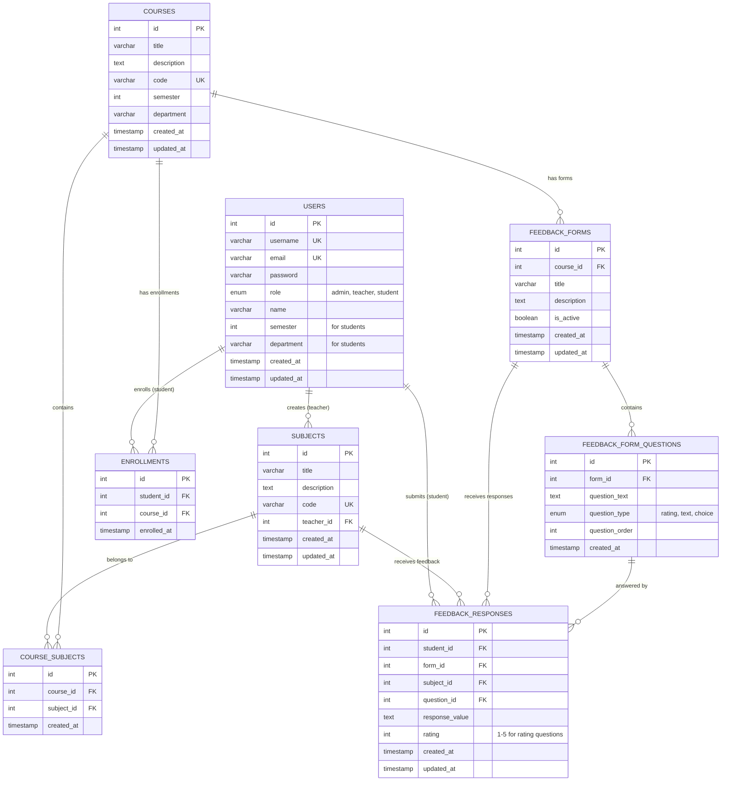
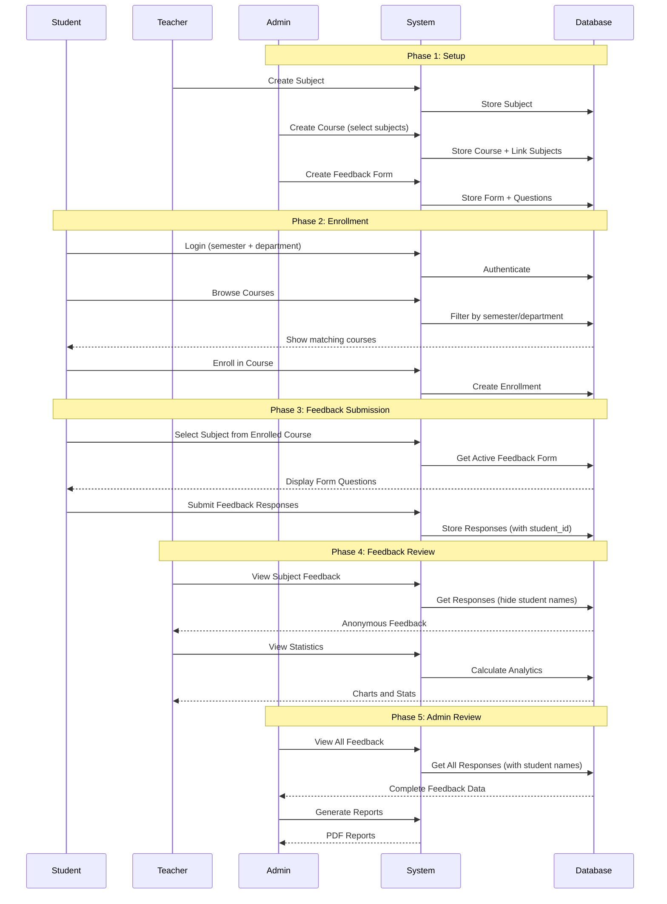
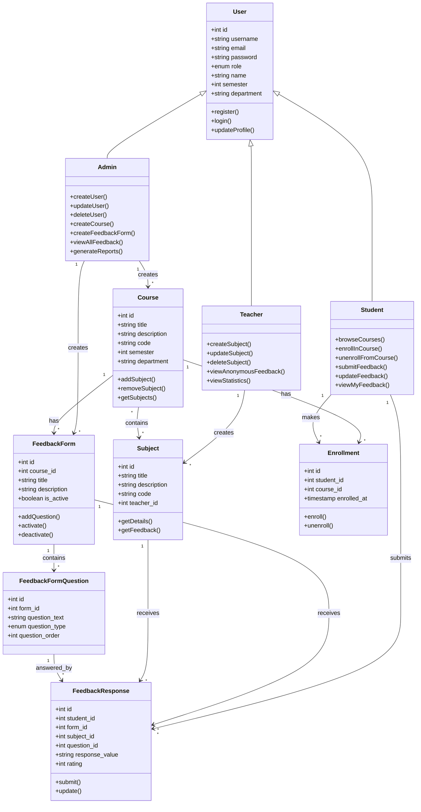
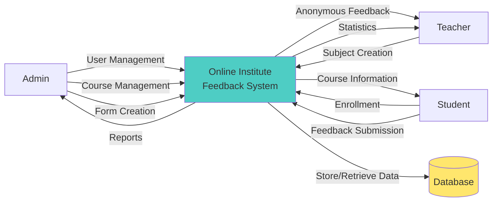
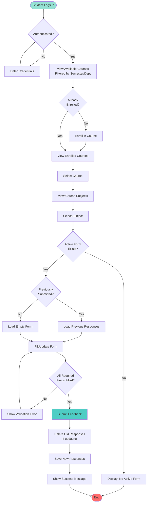
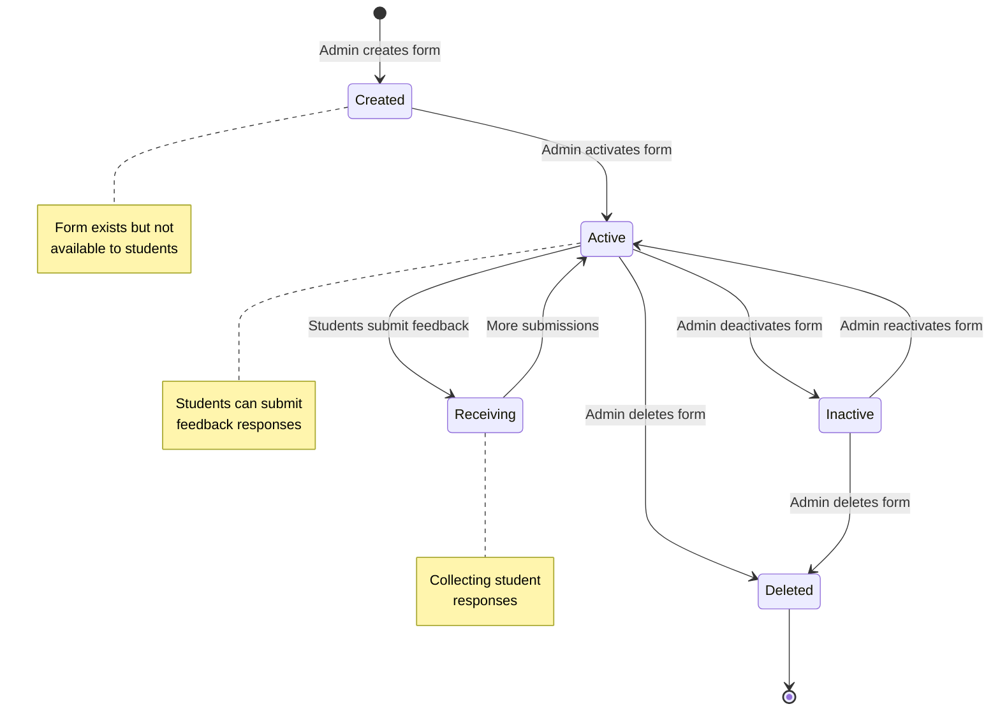

# System Diagrams - Online Institute Feedback System

## 1. USE CASE DIAGRAM

```mermaid
graph TB
    subgraph System["Online Institute Feedback System"]
        subgraph AuthModule["Authentication Module"]
            UC1[Register Account]
            UC2[Login to System]
            UC3[View Profile]
        end
        
        subgraph AdminModule["Admin Module"]
            UC4[Manage Users]
            UC5[Create Course]
            UC6[Update Course]
            UC7[Delete Course]
            UC8[View All Subjects]
            UC9[Create Feedback Form]
            UC10[Add Form Questions]
            UC11[Activate/Deactivate Form]
            UC12[View All Feedback with Names]
            UC13[Generate Reports]
        end
        
        subgraph TeacherModule["Teacher Module"]
            UC14[Create Subject]
            UC15[Update Subject]
            UC16[Delete Subject]
            UC17[View My Subjects]
            UC18[View Anonymous Feedback]
            UC19[View Subject Statistics]
            UC20[View Feedback Analytics]
        end
        
        subgraph StudentModule["Student Module"]
            UC21[Browse Available Courses]
            UC22[Enroll in Course]
            UC23[Unenroll from Course]
            UC24[View Enrolled Courses]
            UC25[Submit Feedback]
            UC26[Update Feedback]
            UC27[View My Feedback]
        end
    end
    
    Admin((Admin))
    Teacher((Teacher))
    Student((Student))
    
    %% Admin connections
    Admin --> UC1
    Admin --> UC2
    Admin --> UC3
    Admin --> UC4
    Admin --> UC5
    Admin --> UC6
    Admin --> UC7
    Admin --> UC8
    Admin --> UC9
    Admin --> UC10
    Admin --> UC11
    Admin --> UC12
    Admin --> UC13
    
    %% Teacher connections
    Teacher --> UC1
    Teacher --> UC2
    Teacher --> UC3
    Teacher --> UC14
    Teacher --> UC15
    Teacher --> UC16
    Teacher --> UC17
    Teacher --> UC18
    Teacher --> UC19
    Teacher --> UC20
    
    %% Student connections
    Student --> UC1
    Student --> UC2
    Student --> UC3
    Student --> UC21
    Student --> UC22
    Student --> UC23
    Student --> UC24
    Student --> UC25
    Student --> UC26
    Student --> UC27
    
    %% Relationships
    UC5 -.includes.-> UC8
    UC9 -.includes.-> UC10
    UC25 -.extends.-> UC26
    UC22 -.requires.-> UC21
    UC25 -.requires.-> UC24
    
    style Admin fill:#ff6b6b
    style Teacher fill:#4ecdc4
    style Student fill:#95e1d3
```

## 2. ENTITY RELATIONSHIP DIAGRAM (ERD)

## 3. DETAILED USE CASE DESCRIPTIONS

### 3.1 Admin Use Cases

#### UC4: Manage Users
- **Actor**: Admin
- **Description**: Admin can create, read, update, and delete user accounts for all roles
- **Precondition**: Admin must be logged in
- **Postcondition**: User account is created/updated/deleted in the system

#### UC5: Create Course
- **Actor**: Admin
- **Description**: Admin creates a course by specifying title, description, code, semester, department, and selecting multiple subjects
- **Precondition**: Subjects must exist in the system
- **Postcondition**: Course is created and linked to selected subjects

#### UC9: Create Feedback Form
- **Actor**: Admin
- **Description**: Admin creates a custom feedback form for a specific course with multiple questions
- **Precondition**: Course must exist
- **Postcondition**: Feedback form is created and ready for student submissions

#### UC12: View All Feedback with Names
- **Actor**: Admin
- **Description**: Admin can view all feedback submissions with student names for accountability
- **Precondition**: Feedback responses exist
- **Postcondition**: Admin sees complete feedback data including student identity

---

### 3.2 Teacher Use Cases

#### UC14: Create Subject
- **Actor**: Teacher
- **Description**: Teacher creates a subject they teach with title, description, and unique code
- **Precondition**: Teacher must be logged in
- **Postcondition**: Subject is created and linked to the teacher

#### UC18: View Anonymous Feedback
- **Actor**: Teacher
- **Description**: Teacher views feedback for their subjects without seeing student names
- **Precondition**: Students have submitted feedback for teacher's subjects
- **Postcondition**: Teacher sees anonymous feedback responses

#### UC19: View Subject Statistics
- **Actor**: Teacher
- **Description**: Teacher views statistical analysis of feedback including average ratings, rating distribution, and response count
- **Precondition**: Feedback responses exist for the subject
- **Postcondition**: Teacher sees visual analytics and statistics

---

### 3.3 Student Use Cases

#### UC21: Browse Available Courses
- **Actor**: Student
- **Description**: Student views courses filtered automatically by their semester and department
- **Precondition**: Student must be logged in with semester and department information
- **Postcondition**: Student sees only relevant courses

#### UC22: Enroll in Course
- **Actor**: Student
- **Description**: Student enrolls in an available course to access its subjects and feedback forms
- **Precondition**: Course must match student's semester and department
- **Postcondition**: Enrollment record is created

#### UC25: Submit Feedback
- **Actor**: Student
- **Description**: Student submits feedback for a subject within an enrolled course using the active feedback form
- **Precondition**: Student must be enrolled in the course, and an active feedback form must exist
- **Postcondition**: Feedback responses are saved and visible to teacher (anonymously) and admin (with name)

#### UC26: Update Feedback
- **Actor**: Student
- **Description**: Student can update their previously submitted feedback
- **Precondition**: Student must have previously submitted feedback
- **Postcondition**: Previous responses are deleted and new responses are saved

---

## 4. SYSTEM WORKFLOW DIAGRAM

## 5. CLASS DIAGRAM

## 6. DATA FLOW DIAGRAM (Level 0 - Context Diagram)

## 7. ACTIVITY DIAGRAM - Student Feedback Submission

## 8. STATE DIAGRAM - Feedback Form Lifecycle

---

## Summary

These diagrams provide a comprehensive view of the **Online Institute Feedback System**:

1. **Use Case Diagram**: Shows all functionalities available to each user role
2. **ER Diagram**: Illustrates database structure and relationships
3. **Use Case Descriptions**: Detailed explanation of key use cases
4. **Sequence Diagram**: Shows the complete workflow from setup to feedback review
5. **Class Diagram**: Object-oriented representation of system entities
6. **Data Flow Diagram**: High-level view of data movement
7. **Activity Diagram**: Step-by-step process of feedback submission
8. **State Diagram**: Lifecycle of feedback forms

The system implements a sophisticated three-tier architecture with role-based access control, ensuring that:
- **Admins** have complete system control
- **Teachers** can manage subjects and view anonymous feedback
- **Students** can enroll in courses and submit feedback with conditional anonymity
