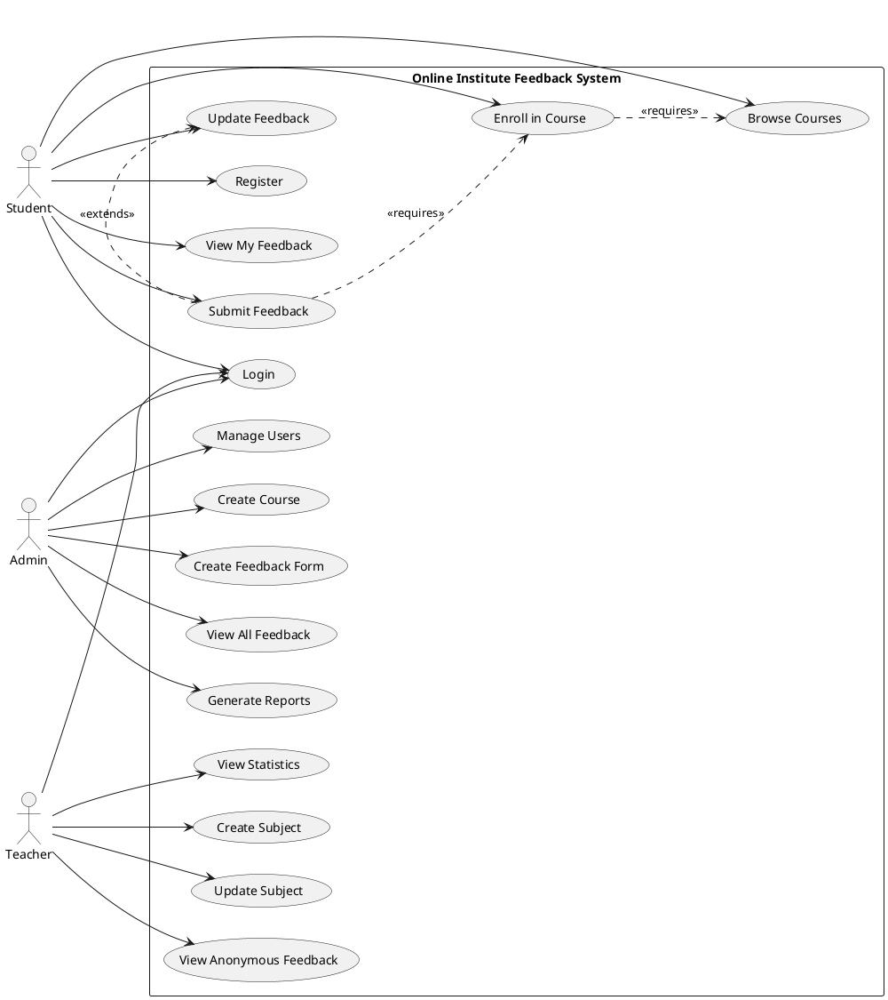

# Use Case Diagram - Online Institute Feedback System

## Generated Use Case Diagram


---

## Use Case Descriptions

### Actors

1. **Admin** - System administrator with full control
2. **Teacher** - Faculty members who create subjects and view feedback
3. **Student** - Students who enroll in courses and submit feedback

---

### Use Cases

#### Authentication & Registration
- **UC01: Register** - New users register with role, semester (students), and department (students)
- **UC02: Login** - All users authenticate to access the system

#### Admin Use Cases
- **UC03: Manage Users** - Create, update, delete user accounts for all roles
- **UC04: Create Course** - Create courses by selecting subjects, semester, and department
- **UC05: Create Feedback Form** - Design custom feedback forms with multiple question types
- **UC06: View All Feedback** - View all feedback submissions with student names
- **UC07: Generate Reports** - Create comprehensive reports and analytics

#### Teacher Use Cases
- **UC08: Create Subject** - Create subjects they teach with title, description, and code
- **UC09: Update Subject** - Modify their own subject details
- **UC10: View Anonymous Feedback** - View feedback for their subjects without student names
- **UC11: View Statistics** - Access analytics and statistics for their subjects

#### Student Use Cases
- **UC12: Browse Courses** - View courses filtered by their semester and department
- **UC13: Enroll in Course** - Enroll in available courses
- **UC14: Submit Feedback** - Submit feedback for subjects in enrolled courses
- **UC15: Update Feedback** - Modify previously submitted feedback
- **UC16: View My Feedback** - View their own submitted feedback history

---

## Relationships

### Actor-Use Case Relationships

**Admin:**
- Login
- Manage Users
- Create Course
- Create Feedback Form
- View All Feedback
- Generate Reports

**Teacher:**
- Login
- Create Subject
- Update Subject
- View Anonymous Feedback
- View Statistics

**Student:**
- Register
- Login
- Browse Courses
- Enroll in Course
- Submit Feedback
- Update Feedback
- View My Feedback

### Use Case Relationships

- **Submit Feedback** extends **Update Feedback** (students can update existing feedback)
- **Enroll in Course** requires **Browse Courses** (must browse before enrolling)
- **Submit Feedback** requires **Enroll in Course** (must be enrolled to submit feedback)

---

## Alternative: PlantUML Code

If you want to generate your own diagram using PlantUML, here's the code:



---

## How to Use PlantUML Code

### Online Tools:
1. **PlantUML Web Server**: https://www.plantuml.com/plantuml/uml/
2. **PlantText**: https://www.planttext.com/

### VS Code:
1. Install "PlantUML" extension
2. Create a `.puml` file with the code above
3. Press `Alt+D` to preview

### Command Line:
```bash
# Install PlantUML
npm install -g node-plantuml

# Generate diagram
puml generate use_case.puml -o use_case.png
```

---

## Alternative: Draw.io Code

You can also recreate this in Draw.io (diagrams.net):

1. Go to https://app.diagrams.net/
2. Create a new diagram
3. Use the UML shapes from the left panel:
   - Actor (stick figure)
   - Use Case (oval)
   - System Boundary (rectangle)
4. Arrange as shown in the generated image

---

## Tips for Your Report

1. **Include the diagram** in your project report under the "System Design" or "Analysis" section
2. **Add descriptions** for each use case explaining the flow
3. **Mention the actors** and their roles clearly
4. **Highlight key features** like conditional anonymity and role-based access
5. **Reference the diagram** when explaining system functionality

